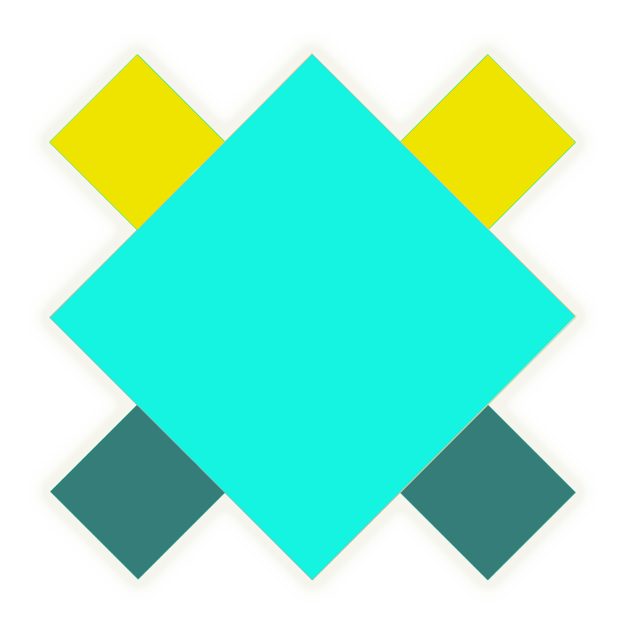

# clunch - 🎨 The Progressive JavaScript Interactive Picture Framework.

- 项目研发中，敬请期待！

  
  
  
  
  

## Issues
使用的时候遇到任何问题或有好的建议，请点击进入[issue](https://github.com/hai2007/clunch/issues)，欢迎参与维护！

## 联系我们

- QQ: 2501482523
- Email: 2501482523@qq.com

开源协议
---------------------------------------
[MIT](https://github.com/hai2007/clunch/blob/master/LICENSE)

Copyright (c) 2020 hai2007 走一步，再走一步。
